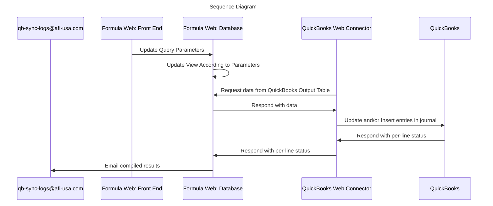

# Formula Web Quickbooks Integration

```mermaid
---
title: Sequence Diagram
---
sequenceDiagram
  participant Outlook as qb-sync-logs@afi-usa.com
  participant FW_FE as Formula Web: Front End
  participant FW_DB as Formula Web: Database
  participant QB_WC as QuickBooks Web Connector
  participant QB as QuickBooks
  FW_FE->>FW_DB: Update Query Parameters
  FW_DB->>FW_DB: Update View According to Parameters
  QB_WC->>FW_DB: Request data from QuickBooks Output Table
  FW_DB->>QB_WC: Respond with data
  QB_WC->>QB: Update and/or Insert entries in journal
  QB->>QB_WC: Respond with per-line status
  QB_WC->>FW_DB: Respond with per-line status
  FW_DB->>Outlook: Email compiled results
```

