# FW3 Data Model

Entity-relationship diagrams for the **fw3** database, generated from
`apps/api/prisma/schema.prisma`. The model is multi-tenant (almost every table
carries a `tenantId` and hangs off `Tenant`) and targets SQL Server. Money and
quantities are always `DECIMAL` (never float); primary keys are app-generated
UUIDs stored as `CHAR(36)`.

A few conventions worth knowing while reading these:

- **Enums are strings + CHECK constraints.** SQL Server has no native enum, so
  fields like `itemType`, `qcStatus`, or `status` are `NVarChar` columns
  constrained in the migration SQL. The allowed values are noted in comments.
- **No cascading deletes.** Every foreign key is `onDelete: NoAction`.
- **`state` columns** are mapped to `status` in the Prisma client (INV / WIP /
  QUARANTINE buckets).
- **Position vs. catalogue.** Master rows (`InventoryItem`, `Container`) hold no
  quantity; the on-hand position and moving-average cost live in a separate stock
  table (`ItemStock` / `ContainerStock`) and an append-only ledger
  (`InventoryTxn` / `ContainerTxn`).

The diagrams are split by domain to stay readable. The
[domain overview](#domain-overview) shows how the domains connect; `Tenant` is
omitted from the per-domain diagrams since it owns nearly everything.

## Domain overview

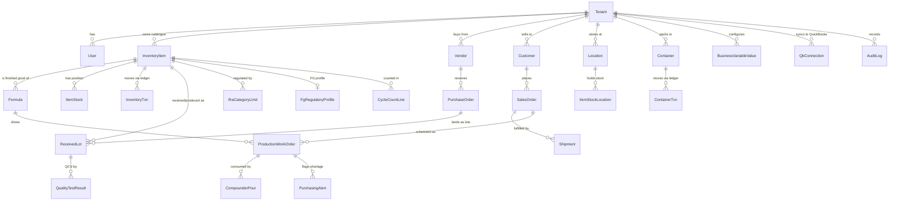

## Tenancy & access control

Tenant isolation plus a role-based permission system. `Permission` is the only
globally-scoped table — permission keys (e.g. `inventory:read`) are app
constants shared across tenants. `RolePermission` and `UserRole` are the
many-to-many join tables.

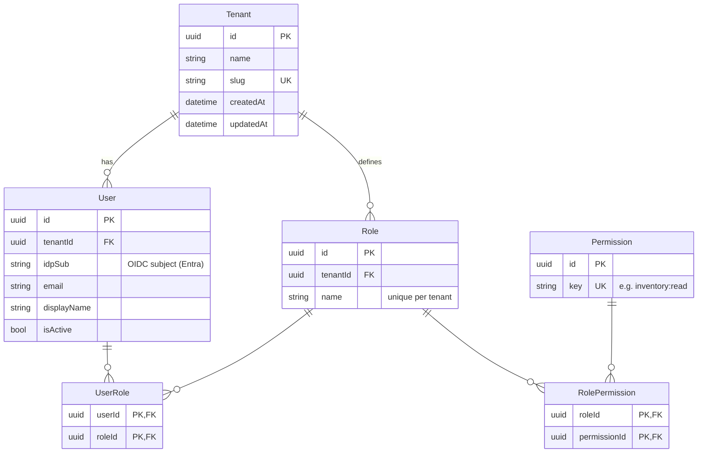

## Item master & formulas

`InventoryItem` is the central catalogue row — the QuickBooks-ready item master.
It deliberately holds **no inventory position**; quantity and moving-average cost
live in `ItemStock` and the ledger. `Formula` defines a finished good as a set of
raw materials by percentage of weight (`FormulaLine`); lines for a formula must
sum to 100. `ItemQualitySpec` carries the per-item QC acceptance criteria.

Regulatory data hangs off the item: `IfraCategoryLimit` records, per raw
material, the maximum percentage it may reach in a finished product of a given
IFRA use category (49th Amendment). For finished goods, `FgRegulatoryProfile` is
the FormPak+ snapshot (the third-party data we can't derive in-house) with its
per-category `FgIfraLevel` rows. `reorderPoint` flags replenishment;
`productionUse` hides R&D/lab-only materials from the compounder dosing tool.

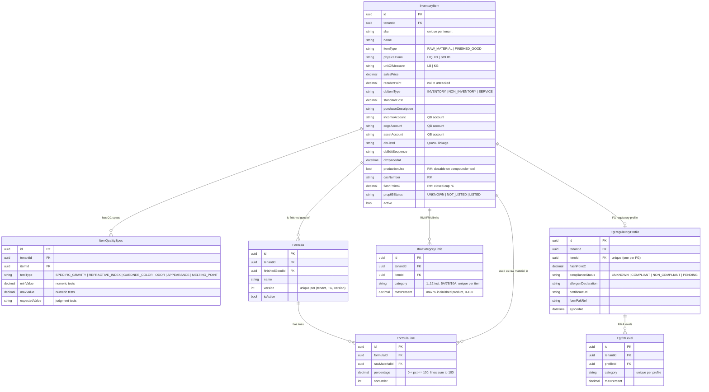

## Inventory position, locations & ledger

The authoritative on-hand picture. `ItemStock` is the per-(item, state) position
(INV = lot-traceable, WIP = work-in-progress). `Location` is a typed tree
(BUILDING → AISLE → RACK, plus AREA nodes), and `ItemStockLocation` breaks an
item's quantity down by location — the sum over locations for an (item, state)
equals the `ItemStock` row. `InventoryTxn` is the append-only stock ledger:
every quantity change is one signed line carrying the running balance and
weighted-average cost. `LocationMove` is the parallel ledger for physical moves
between locations.

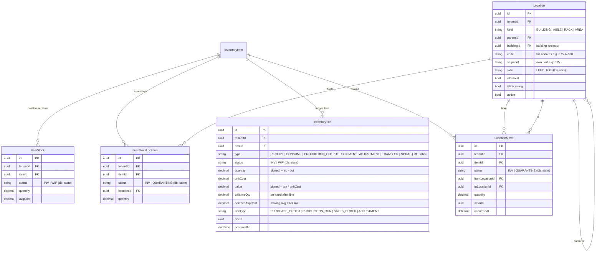

## Lots, quality control, scrap & vendor returns

A `ReceivedLot` is a lot of material pending or past QC — origin `RECEIPT`
(from a vendor PO) or `PRODUCTION` (from a work order). Source references
(vendor, PO, work order) are snapshotted by name for history. `QualityTestResult`
records each acceptance test against the lot. `ScrapRecord` is a write-off (with
a structured reason) and `VendorReturn` is a return-to-vendor of QC-failed raw
material — both pair with a matching `InventoryTxn` (`SCRAP` / `RETURN`).

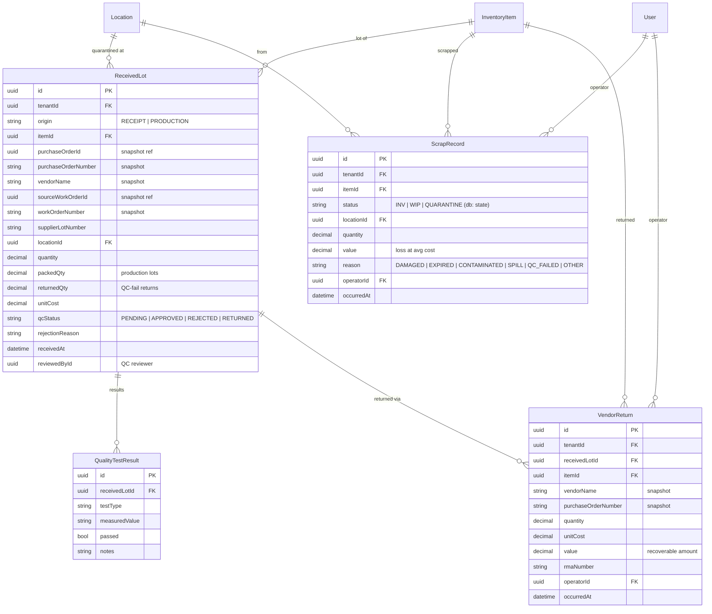

## Purchasing

Vendors and their purchase orders. `Vendor` carries tax/payment-term details and
has any number of addresses and contacts (scoped through the vendor, no
`tenantId` of their own). The `suppliesMaterials` / `suppliesContainers` flags
drive which subjects the PO page offers. A `PurchaseOrderLine` buys **either** an
inventory item or a container (exactly one; CHECK) and tracks ordered vs.
received quantity.

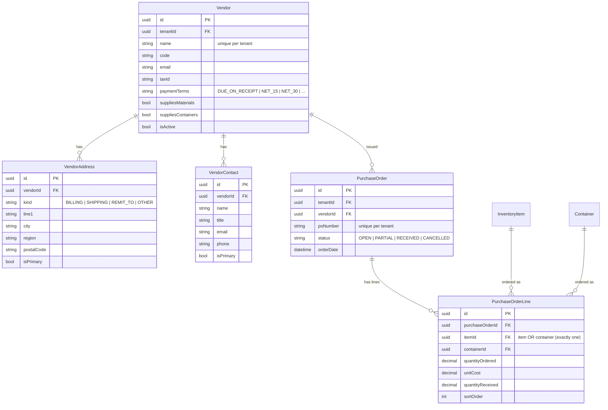

## Sales

Mirrors purchasing. `Customer` adds a buy-volume `rating` (A–D) on top of the
shared contact/address structure. A `SalesOrderLine` sells **either** an
inventory item (`lineType = ITEM`) or a container itself
(`lineType = CONTAINER`, via `productContainerId`); ITEM lines may carry a
packing plan (`containerId` + `containerQuantity`). `SalesOrder` tracks the
committed `requestedShipDate` (drives scheduler sequencing), `paidAt` (net-terms
customers may request production unpaid), and `packedAt`. Shipments and
SO-linked production work orders hang off the order — see
[Shipments](#shipments) and [Production](#production).

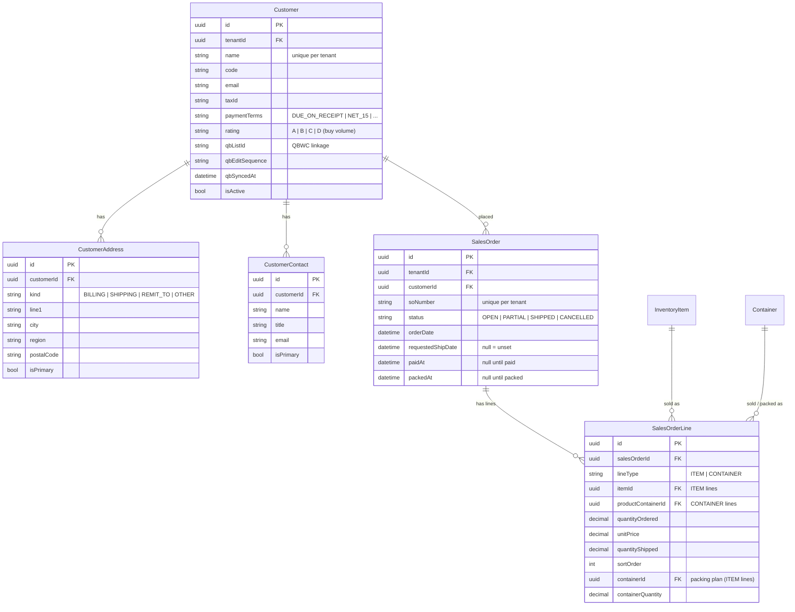

## Shipments

A `Shipment` is a first-class physical despatch against a sales order — its own
number, carrier, and tracking. Partial fulfilment produces several shipments per
order. Each `ShipmentLine` mirrors the SO line it fulfils and **snapshots
`unitCost` at ship time** for COGS; the matching `SHIPMENT` ledger lines reduce
stock alongside.

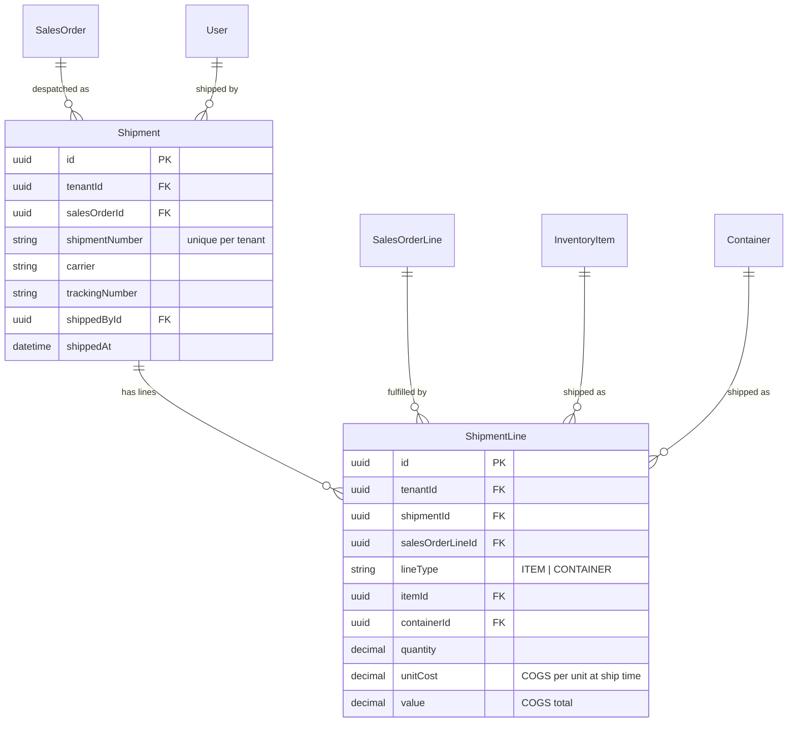

## Containers (packaging)

Packaging stock — drums, pails, jugs, cans, bottles, totes — that fragrance is
packed into, and that can also be sold or ordered on its own. The
`Container`/`ContainerStock`/`ContainerTxn` trio mirrors the
item/stock/ledger split, but there is a **single on-hand bucket** (no WIP or QC
staging) and quantities are whole counts. `capacityLb` is the nominal fill weight
used to default packing counts.

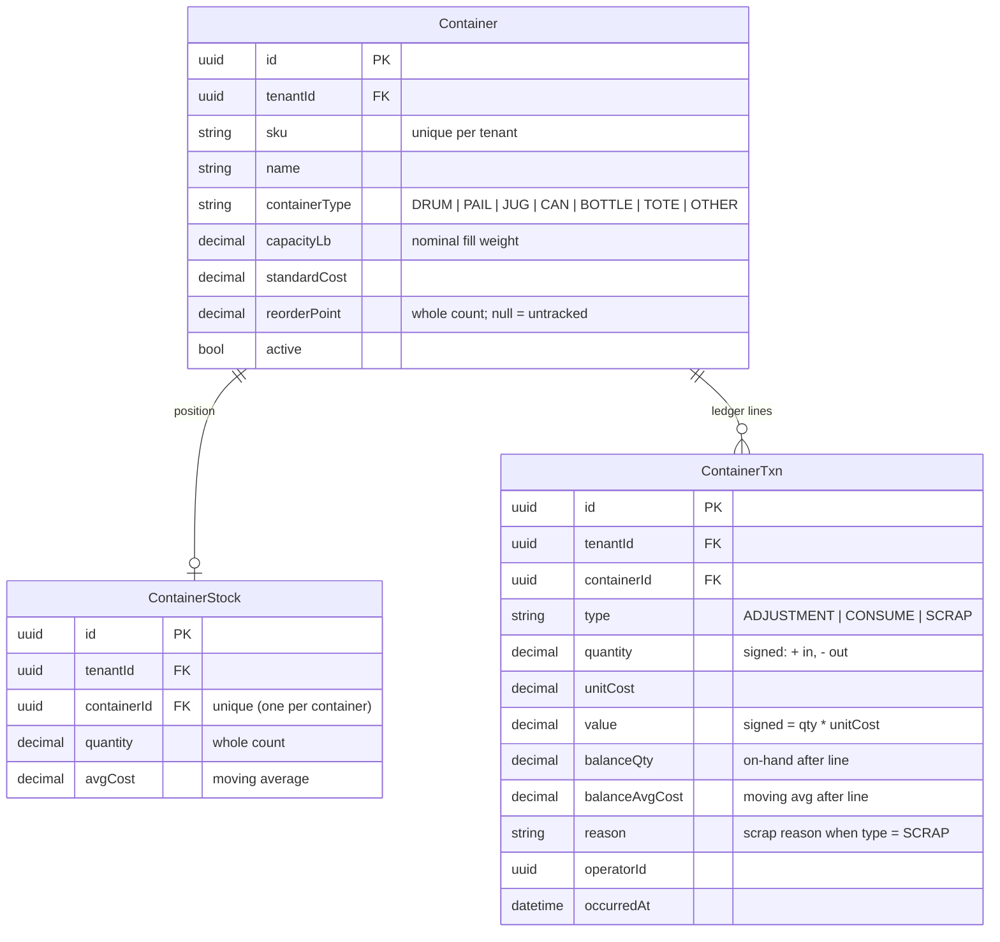

## Production

A production work order makes a target item from a formula. Flow:
`PLANNED → STAGED → IN_PROGRESS → COMPLETED` (components move INV → WIP on
staging, are consumed from WIP, and output lands in FG-WIP before a separate
pack-off step). `CompounderPour` is the append-only record of each dose an
operator reports from the compounder dosing tool; every pour also posts a
`CONSUME` ledger line. (Physical tables retain their original `ProductionRun`
names via `@@map`.) A work order may be linked to the sales order/line it
fulfils (`salesOrderId` / `salesOrderLineId`; null for ad-hoc runs) and ordered
in the scheduler queue via `queuePosition`. When the scheduler can't source a
component, it raises a `PurchasingAlert` for purchasing to act on.

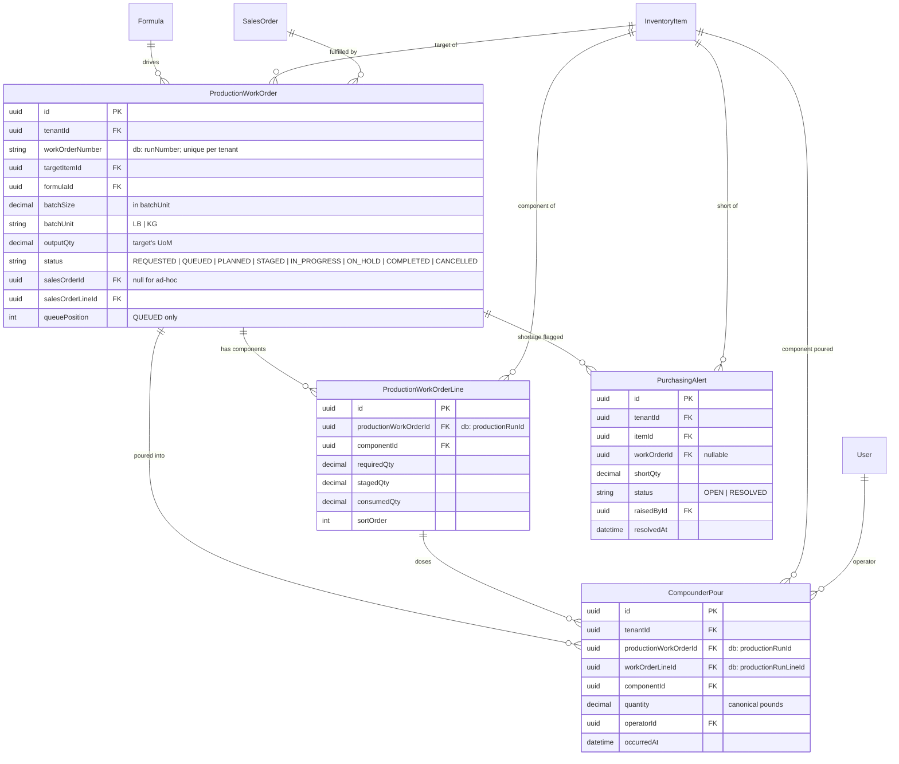

## Cycle counts

Verifying physical inventory against the system, then posting variances as
`ADJUSTMENT` ledger lines. A `CycleCount` is scoped to a location (or the whole
tenant when `scopeLocationId` is null) and can be **blind** (system quantity
hidden from the counter). Each `CycleCountLine` is one (item, state, location)
cell: `expectedQty` is the snapshot at creation, `countedQty` is what was found.

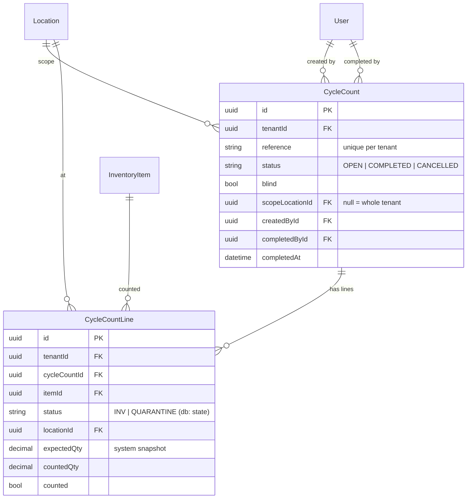

## Business configuration

Tenant-tunable settings. `BusinessVariableValue` stores **only the overrides** of
a code-defined variable catalog (working hours, default profit margin, pph per
workstation, production efficiency, production cost factor); unset entries fall
back to their catalog defaults. `operatorRole` is null for non-role-scoped
variables, or one row per role for role-scoped ones. `CompanyHoliday` encodes
closure days as recurrence rules so one row covers every year.

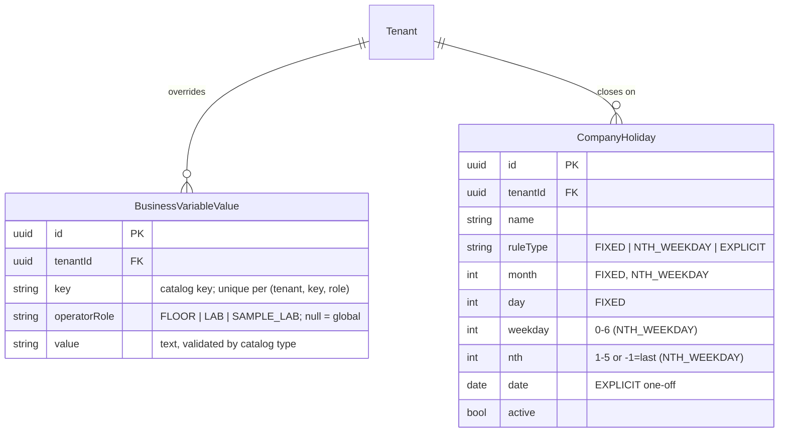

## QuickBooks sync & audit

Per-tenant QuickBooks Web Connector connections and their in-flight sync
sessions, plus the tenant-wide audit log (before/after JSON snapshots of every
CREATE/UPDATE/DELETE/SYNC).

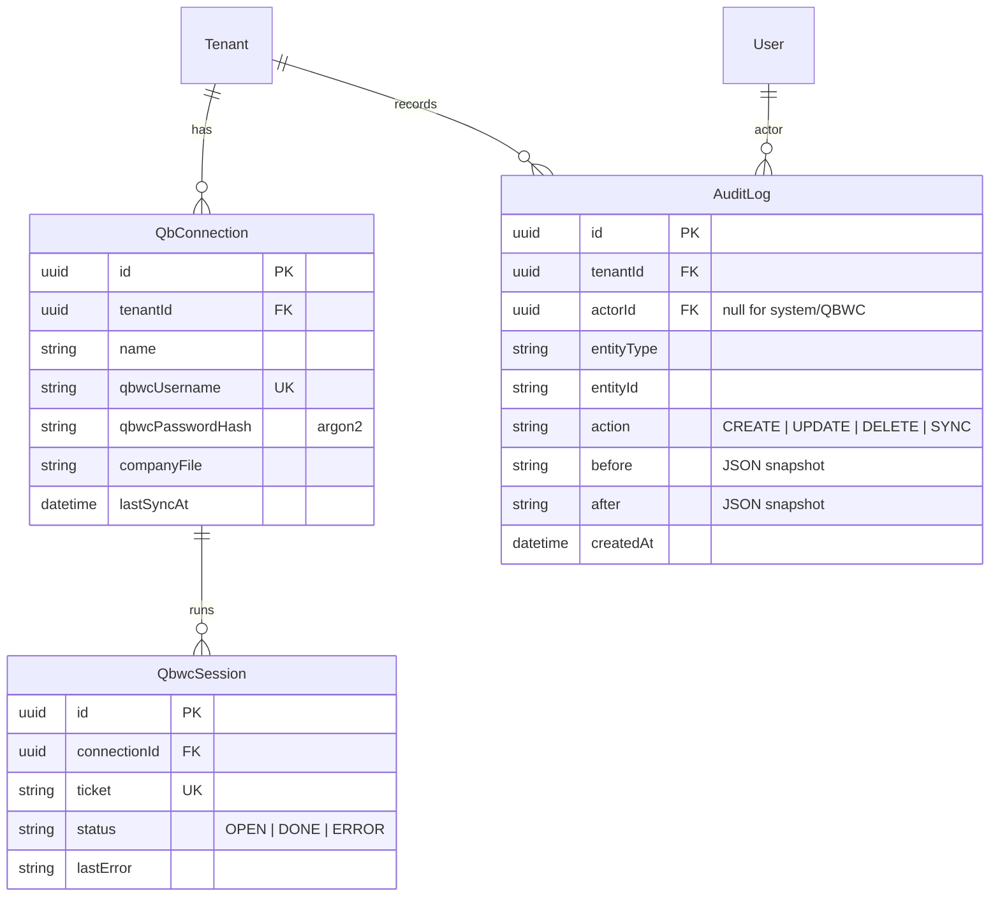
