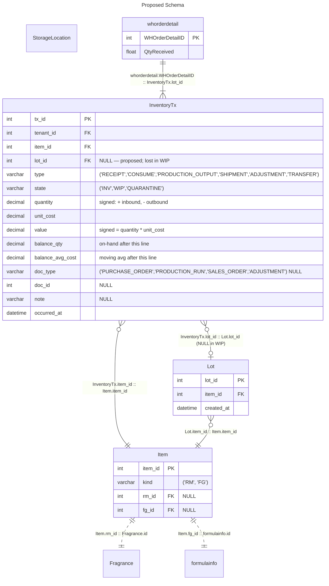
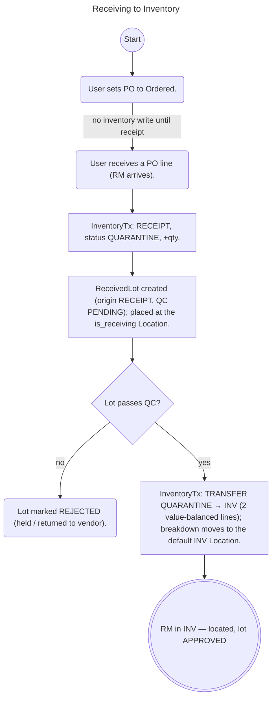
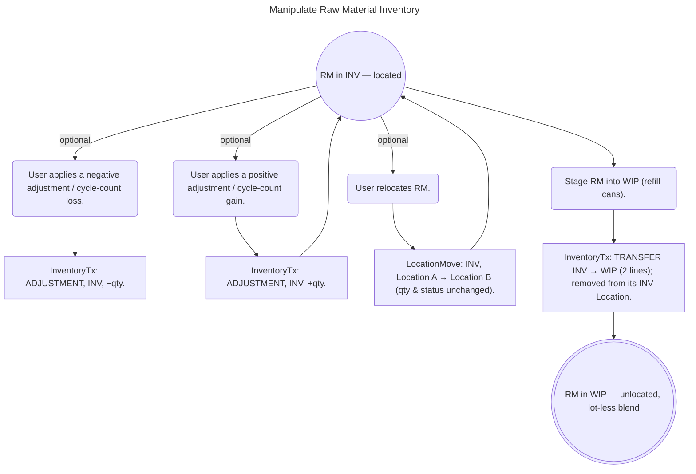
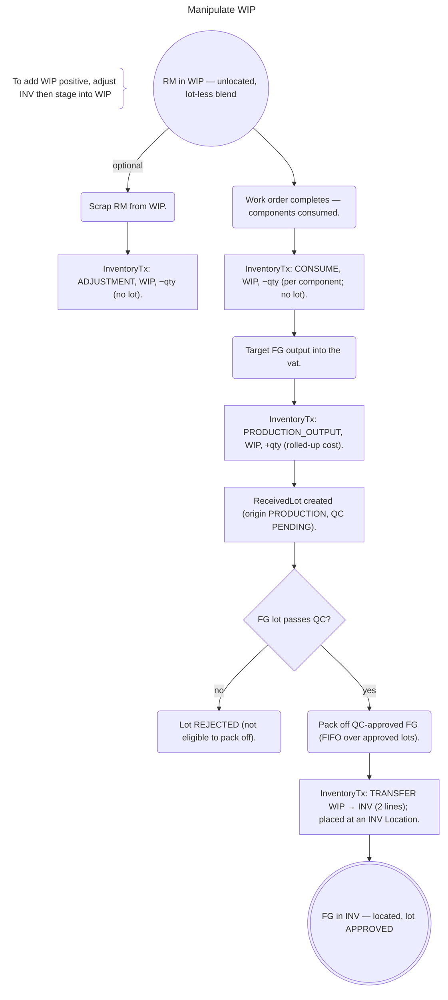
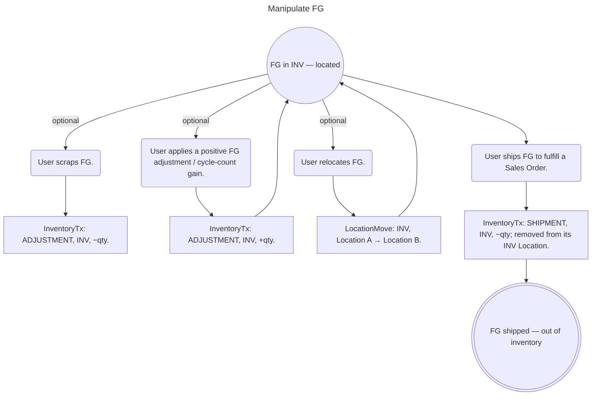
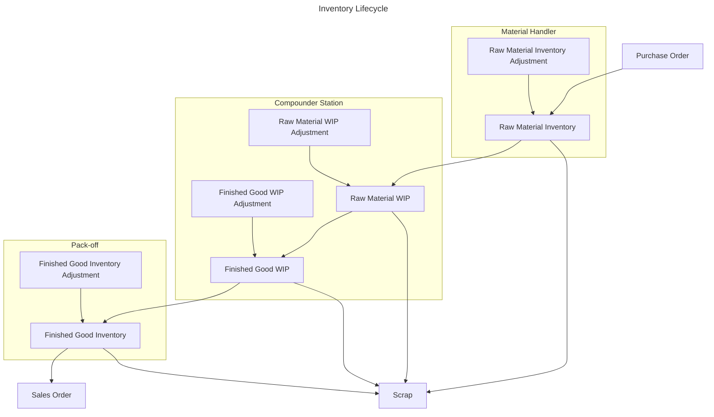
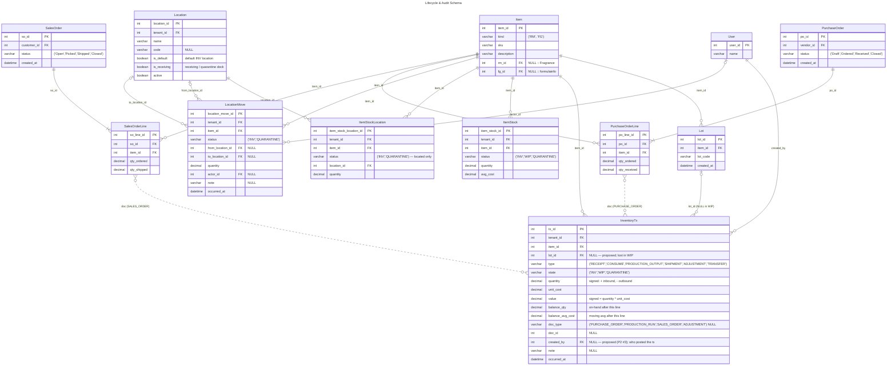

# Tx Table Proposal

## Diagrams

> [!WARNING]
> Current layout not showing Formula Stock Inventory?

> [!NOTE]
> The flowcharts below are modeled on fw3's **two ledgers**. Rectangles are ledger
> writes — `InventoryTx:` lines carry a `type`, a `status` (`INV` / `WIP` /
> `QUARANTINE`) and a signed quantity; `LocationMove:` lines are physical relocations
> within a status. Rounded nodes are user/physical actions, diamonds are decisions,
> and triple-circle nodes are resting states. Physical `Location`s are real; system
> boundaries (Vendor, Customer, Scrap, Shipping) are **not** entities. A status
> transfer (e.g. `QUARANTINE` → `INV`) is two value-balanced `InventoryTx` lines, and
> lot identity (`ReceivedLot`) is tracked in `INV`/`QUARANTINE` but lost in the `WIP`
> blend.

The schema below is built to facilitate this life-cycle. Quantity, cost, and
`status` (`INV` / `WIP` / `QUARANTINE`) changes are recorded as append-only rows in
`InventoryTx`; physical relocation **within** a status is recorded in the separate
append-only `LocationMove` ledger. Together they are the immutable transaction
history for auditing material flow.

> [!IMPORTANT]
> `InventoryTx` mirrors fw3's `InventoryTxn` and is **item-keyed with no location
> columns**: `tenant_id`, `item_id`, `type`, `state` (`INV` / `WIP` / `QUARANTINE`),
> a **signed** `quantity`, `unit_cost` / `value`, the carried `balance_qty` /
> `balance_avg_cost`, `doc_type` / `doc_id`, `note`, and `occurred_at`. `lot_id`
> (P1 #1) and `created_by` (P2 #3) remain proposed extensions not yet in fw3.

> [!IMPORTANT]
> **fw3 splits inventory across two append-only ledgers — neither is a
> location-stamped `InventoryTx`** (this supersedes the earlier "`from`/`to` on the
> ledger" proposal):
> - **`InventoryTx`** records quantity, cost, and `status` changes (`INV` / `WIP` /
>   `QUARANTINE`); status transitions (`QUARANTINE` → `INV` at QC, `INV` → `WIP` at
>   staging, `WIP` → `INV` at pack-off) are `TRANSFER` lines. `ItemStock` is the
>   per-(item, status) position.
> - **`LocationMove`** records physical relocation **within** a status (qty and
>   status unchanged), carrying its own `actor_id`. `ItemStockLocation` is the
>   per-(item, status, location) quantity breakdown, kept only for located statuses
>   (`INV`, `QUARANTINE`); **`WIP` is not located**.
>
> `Location` is **physical only** (warehouse / room / bin / dock, with `is_default`
> and `is_receiving` flags) — there are **no** boundary/virtual locations.

The flowcharts below predate this split. Each conceptual "move" lands in the
quantity/status ledger (`InventoryTx`), the physical-location ledger
(`LocationMove`), or both; the system-boundary "locations" are not entities:

| Flowchart move | `InventoryTx` (qty / status) | Location effect | Driver |
| --- | --- | --- | --- |
| Receive RM | `RECEIPT`, `QUARANTINE`, + | placed at `is_receiving` Location | PO line |
| Pass QC | `TRANSFER` `QUARANTINE` → `INV` | breakdown → default `INV` Location | QC review |
| Relocate | — | `LocationMove` (`INV`, from → to) | move op |
| Stage into WIP | `TRANSFER` `INV` → `WIP` | removed from Location (`WIP` unlocated) | work order |
| Consume (complete) | `CONSUME`, `WIP`, − | — | work order |
| Output FG (complete) | `PRODUCTION_OUTPUT`, `WIP`, + | — (`WIP` unlocated) | work order |
| Pack-off FG | `TRANSFER` `WIP` → `INV` | placed at `INV` Location | work order |
| Adjust (+/−) | `ADJUSTMENT`, +/− | breakdown +/− if located | adjustment / count |
| Scrap | `ADJUSTMENT`, − | removed if located | adjustment |
| Ship FG | `SHIPMENT`, `INV`, − | removed from Location | SO line |

> [!NOTE]
> `InventoryTx` is **append-only**. Corrections are made by posting a reversing
> transaction, never by editing or deleting a row — this preserves a complete
> audit trail. The `doc_type` / `doc_id` pair links a line back to whatever drove
> the movement (a PO, production run, sales order, or adjustment), and the proposed
> `created_by` records who posted it.

> [!TIP]
> `Location` maps to the legacy `StorageLocation` (physical building locations). The
> system-boundary "Special Locations" below are **not** locations in fw3 — they are
> implicit (see that section). An item's on-hand and moving-average cost are carried
> per `InventoryTx` line as `balance_qty` / `balance_avg_cost`, and the
> per-(item, status) position is `ItemStock`; `ItemStockLocation` breaks the located
> statuses (`INV`, `QUARANTINE`) down by `Location`, summing to the `ItemStock` row.

> [!NOTE]
> `item_id` is set on **every** `InventoryTx` row. The proposed `lot_id` (fw3's
> `ReceivedLot`) is set only while material is lot-trackable: the `RECEIPT`, the QC
> `TRANSFER`, and `INV` adjustments carry it, as do the FG pack-off `TRANSFER` and
> `INV` lines. The `CONSUME` and `ADJUSTMENT` lines in `WIP` carry a **null** lot —
> RM blends in the refill cans, so its lot can no longer be recovered. The
> stage-into-`WIP` `TRANSFER` is the last lot-attributed line for an RM lot; lot
> identity resumes with the PRODUCTION `ReceivedLot` at output.

### Special Locations (not modeled as locations in fw3)

fw3 has **no** boundary/virtual locations; only physical `Location`s exist. The
"special locations" the flowcharts use map onto fw3 as:

- **Vendor / Customer** — system boundaries, not stored. Crossing one is an
  `InventoryTx` `RECEIPT` (inbound) or `SHIPMENT` (outbound).
- **Receiving** — a physical `Location` (`is_receiving` = true); received stock
  sits there under `QUARANTINE` status until QC passes (`TRANSFER` to `INV`).
- **Scrap** — not a location; a negative `ADJUSTMENT`.
- **WIP** — an `InventoryTx` / `ItemStock` `status`, **not** located (refill-can blend).
- **FG** — not a location; finished goods are an `Item` (`kind` = FG) held under
  `INV` status at a physical `Location`.
- **Shipping** — not modeled; the `SHIPMENT` line removes stock from its location.

## Goals

- [x] Single Source of Truth

> Accomplished with InventoryTx table for both RMs & FGs w/ views.

- [x] Transactions for **all** RM & FG movements

> `InventoryTx` and `Lot` tables accommodate this.

- [x] Net-0 tables

> Using views (old::new): 16:12

- [x] Minimal Tool Breakage

> Views with matching interface to replaced tables will reduce breakage. Will still require populating `InventoryTx` table to match current state.

## Ledger Design: Two-Ledger vs Single-Ledger

fw3 keeps **two append-only ledgers**, and the position tables are derived from
them (mutable, upserted — not ledgers):

| Table | Role | Records |
| --- | --- | --- |
| `InventoryTx` (fw3 `InventoryTxn`) | quantity / cost / status ledger | `RECEIPT`, `CONSUME`, `PRODUCTION_OUTPUT`, `SHIPMENT`, `ADJUSTMENT`, `TRANSFER`; carries running `balance_qty` / `balance_avg_cost` per (item, status) |
| `LocationMove` | physical-move ledger | relocation **within** a status (`INV` / `QUARANTINE`); value-neutral; carries `actor_id` |
| `ItemStock` | position (derived) | per (item, status) quantity + avg cost |
| `ItemStockLocation` | position (derived) | per (item, status, location) quantity — located statuses only |

A **single-ledger** design would fold physical moves into `InventoryTx` (a
nullable `location_id`, or `from`/`to`, with a relocation recorded as one
`from→to` row or two signed rows) and derive both position tables from that one
ledger. It is feasible, but the trade-offs favor keeping the split.

**Keep two ledgers (recommended) because:**

- The quantity/cost ledger is the accounting-critical record (weighted-average
  cost, `value`). Relocations are frequent and **value-neutral**; merging them in
  pollutes every cost/quantity query with physical-move noise.
- `InventoryTx`'s invariant "latest line per (item, status) is the position" stays
  clean only if value-neutral relocations are kept out of it.
- WIP is not located; INV/QUARANTINE are. The split lets `ItemStockLocation` /
  `LocationMove` keep a DB-enforceable "located rows always have a location"
  guarantee. A single ledger forces a nullable `location_id` (null for WIP) and
  loses that.
- The two ledgers can be written and locked independently; relocations don't
  contend on (or bloat the indexes of) the valuation-source table.

**A single ledger would buy:**

- One source of truth — no chance of the two ledgers drifting (though fw3 already
  keeps them consistent: every move runs in a DB transaction, and
  `ItemStockLocation` sums to the `ItemStock` status total).
- One unified actor column. But `LocationMove` already has `actor_id` and
  `InventoryTx` does not — that gap (P2 #3) is far cheaper to close by adding
  `created_by` to `InventoryTx` than by merging the ledgers.

**Verdict:** keep the two-ledger split. If a single source of truth ever became
necessary, the cleanest variant is a single **fully-located, signed** ledger
(relocation = two rows) that derives both position tables — worth taking on only
if the ledgers were actually drifting in practice, which they are not.

## Notes

> [!CAUTION]
> Changing the process to use `InventoryTx` table will break **all** inventory-related writes & updates. This will require an overhaul of the system, projected to affect more than 80% of the code.

> [!IMPORTANT]
> The `InventoryTx` ledger is keyed by `item_id` (always set) with an **optional** `lot_id`, mirroring fw3's implemented `InventoryTxn` (item-keyed, with an `INV` / `WIP` state). LOT traceability is **physically lost** when RM moves into WIP: the material is poured into refill cans and blends with other lots of the same item, so no single lot can be recovered. From that point a line records the `Item` but a `null` `Lot`; lot traceability resumes when a new FG `Lot` is created at pack-off.

> [!NOTE]
> Because WIP is a lot-less blend, only the RM LOTs whose (lot-attributed) move-into-WIP lines fed that blend can be said to _possibly_ have affected a pour — the exact lot is unrecoverable. Tracing those candidate LOTs is separate from the internal LOTs consumed when a pour is performed. Internal LOTs should **always** consume FIFO regardless of traced internal LOT(s).

> [!TIP]
> Pours should generate `Consumptions` against the RM (possibly using the Command/Event pattern), and those consumptions should be applied against the WIP inventory in FIFO order _after_ the pour is completed.

> [!IMPORTANT]
> RSM wants to use `InventoryTx` table for **both** Raw Materials and Finished Goods.

> [!TIP]
> CoPilot recommends a `Lot` table in order to track both Raw Materials and Finished Goods within the `InventoryTx` table. Each `Lot` carries a surrogate `lot_id` and references an `Item`, whose `kind` enum (`'RM'`, `'FG'`) distinguishes Raw Materials from Finished Goods. A `Lot` exists only while material is lot-trackable (RM in inventory, FG after pack-off); the `INV` / `WIP` distinction is **not** a property of the `Lot` but of each `InventoryTx` line (its `WIP` location). _When accessing a `Lot`, its `Item.kind` should **always** be checked._

> [!IMPORTANT]
> RSM wants to replace `formula_stock_lot_adjustment`, `WHPrepStockDetail`, `whprep_StorageLocation_Lot`, `whorderdetail`, `whprepdetail_qtydetail`, and `multi_StorageLocation` with views against `InventoryTx` table as interfaces to prevent tool breakage.

> [!NOTE]
> Following FIFO physically on the floor is impractical, does not have much benefit, and physical processes keep the state close enough to correct.

> [!TIP]
> Adding the `Item` table goes against keeping the number of new tables to a minimum, but we are still well below the net-0 table requirement by using the views. CoPilot insists that the `Item` table is necessary for referential integrity, keeping query complexity minimal (reducing number of joins), performance and indexing, and future flexibility.

## Questions

Why is the current system tying pours directly to LOT numbers for consumption?
  :

Why does the system require a specific LOT assignment at time of `Start Prep`?
  :

When a Raw Material is consumed for a Finished Good, but the Finished Good has not been packaged, where is the Raw Material at that point? It's in the Finished Good, but the Finished Good doesn't truly exist yet. When the Finished Good is made, where should it come from? WIP?
  : The RM is consumed out of `WIP` when the work order completes — an `InventoryTx` `CONSUME`, `WIP`, −qty (lot-less; the refill-can blend). The Finished Good is _produced_, not moved: a separate `PRODUCTION_OUTPUT`, `WIP`, +qty posts the FG into the vat (a new PRODUCTION `ReceivedLot`, QC PENDING) at the rolled-up consumed cost. They are independent signed postings on different items — consumed value equals output value, so it balances without the FG being "sourced from" the RM. Pack-off is later a `TRANSFER` `WIP` → `INV`.

When more Finished Good is found during a cycle count, and the inventory is positively adjusted, what should be the `from`?
  : There is no `from`/`to` — fw3's ledger is signed. A positive count is an `InventoryTx` `ADJUSTMENT`, `INV`, +qty (no source to debit), and the located breakdown places the extra at its `Location`; a negative count is the same shape with −qty (scrap/loss included). This applies to both RM and FG. See the `Manipulate FG` flowchart's `tx_adjust_fg_positive`.

Should additional "Special" locations be added for system boundaries ("Vendor", "Customer", etc.)? Current flowcharts show both yes and no.
  : **No** — fw3 settled this. `Location` is physical only; system boundaries (Vendor, Customer, Scrap, Shipping) are implicit in the `InventoryTx` `type` (`RECEIPT` / `SHIPMENT` / `ADJUSTMENT`), not stored as locations. The one real physical location for a "boundary" is **Receiving** (`is_receiving` = true), where received stock is held under `QUARANTINE` until QC passes. See "Special Locations" above.
