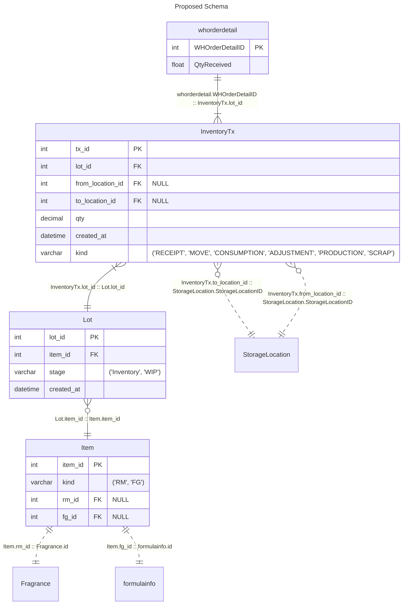
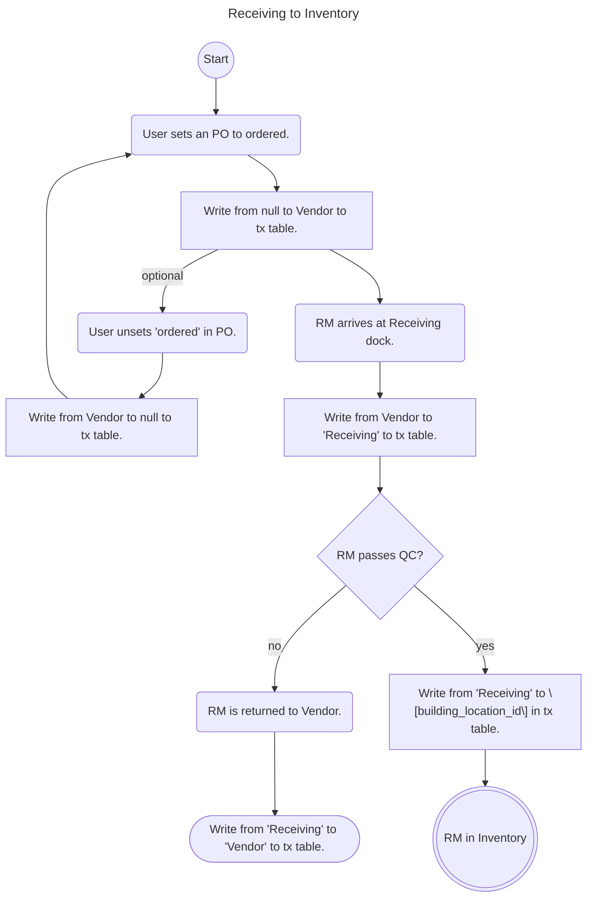
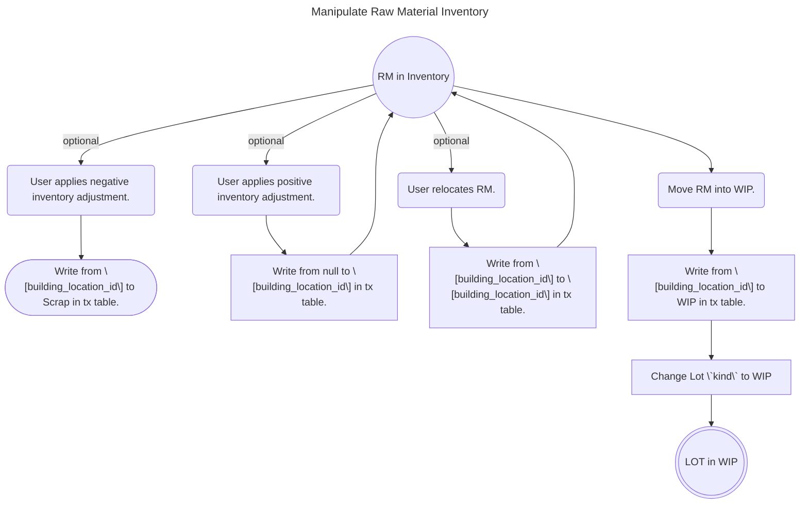
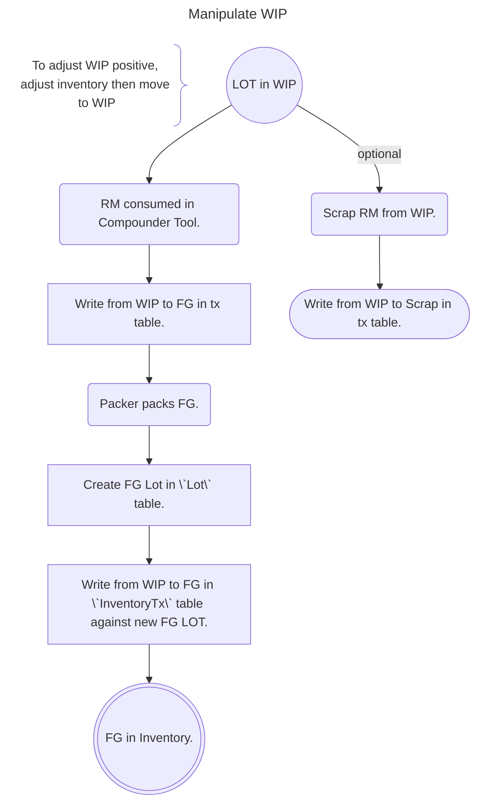

# Tx Table Proposal

## Diagrams

> [!WARNING]
> Current layout not showing Formula Stock Inventory?

### Special Locations

- Vendor
- Receiving
- WIP
- FG
- Shipping
- Scrap

## Goals

- [x] Single Source of Truth

> Accomplished with InventoryTx table for both RMs & FGs w/ views.

- [x] Transactions for **all** RM & FG movements

> `InventoryTx` and `Lot` tables accommodate this.

- [x] Net-0 tables

> Using views (old::new): 16:12

- [x] Minimal Tool Breakage

> Views with matching interface to replaced tables will reduce breakage. Will still require populating `InventoryTx` table to match current state.

## Notes

> [!NOTE]
> Tracing which WIP LOTs _could_ have affected a pour is separate from the internal LOTs consumed when a pour is performed. Internal LOTs should **always** consume FIFO regardless of traced internal LOT(s).

> [!TIP]
> Pours should generate `Consumptions` against the RM (possibly using the Command/Event pattern), and those consumptions should be applied against the WIP inventory in FIFO order _after_ the pour is completed.

> [!IMPORTANT]
> RSM wants to use `InventoryTx` table for **both** Raw Materials and Finished Goods.

> [!TIP]
> CoPilot recommends a `Lot` table in order to track both Raw Materials and Finished Goods within the `InventoryTx` table. To enable tracking both RM LOTs (`int`) and FG LOTs (`varchar`), it recommends having a `kind` enum column and cast all LOT codes to `varchar` in the `Lot` table. _When accessing the table, row `kind` should **always** be checked._

> [!IMPORTANT]
> RSM wants to replace `formula_stock_lot_adjustment`, `WHPrepStockDetail`, `whprep_StorageLocation_Lot`, `whorderdetail`, `whprepdetail_qtydetail`, and `multi_StorageLocation` with views against `InventoryTx` table as interfaces to prevent tool breakage.

> [!NOTE]
> Following FIFO physically on the floor is impractical, does not have much benefit, and physical processes keep the state close enough to correct.

> [!TIP]
> Adding the `Item` table goes against keeping the number of new tables to a minimum, but we are still well below the net-0 table requirement by using the views. CoPilot insists that the `Item` table is necessary for referential integrity, keeping query complexity minimal (reducing number of joins), performance and indexing, and future flexibility.

## Questions

Why is the current system tying pours directly to LOT numbers for consumption?
  :

Why does the system require a specific LOT assignment at time of `Start Prep`?
  :

When a Raw Material is consumed for a Finished Good, but the Finished Good has not been packaged, where is the Raw Material at that point? It's in the Finished Good, but the Finished Good doesn't truly exist yet. When the Finished Good is made, where should it come from? WIP?
  :

When more Finished Good is found during a cycle count, and the inventory is positively adjusted, what should be the `from`?
  :

Should additional "Special" locations be added for system boundaries ("Vendor", "Customer", etc.)? Current flowcharts show both yes and no.
  :
