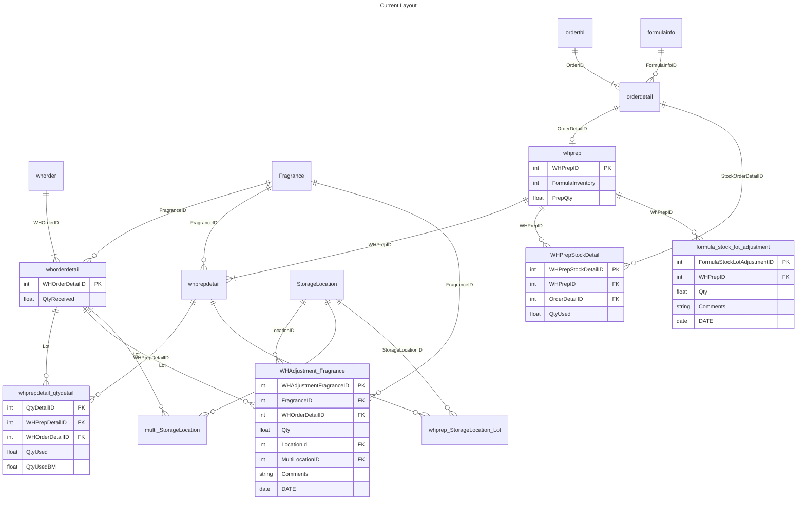
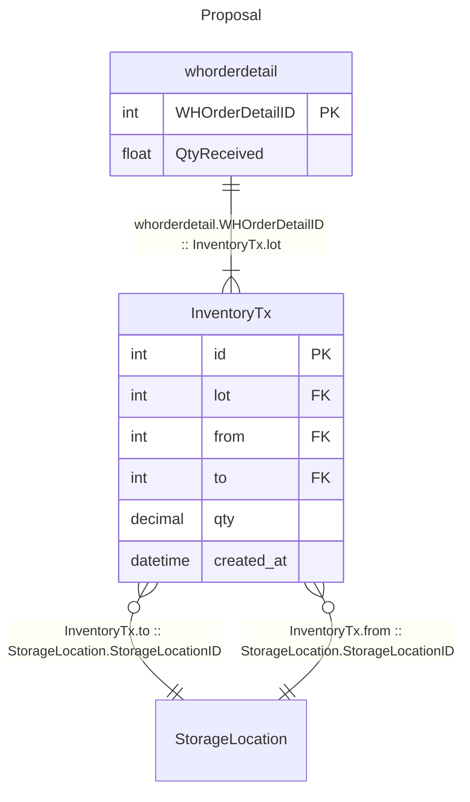
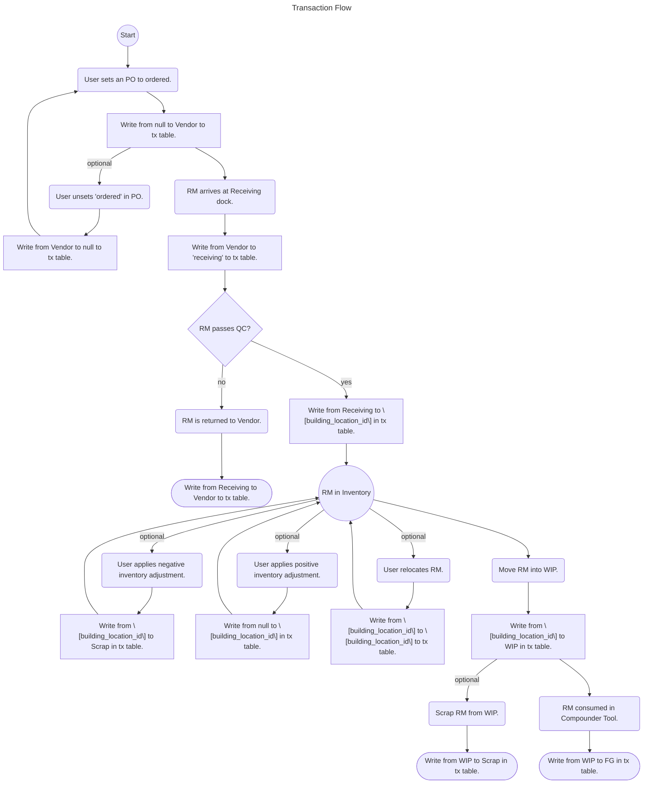

# Tx Table Proposal

## Diagrams

> [!WARNING]
> Current layout not showing Formula Stock Inventory?

### Special Locations

- Vendor
- Receiving
- WIP
- FG
- Shipping
- Scrap

## Requirements

- Single source of truth
- Transactions for **all** RM and FG movements
- net-0 tables
- minimal tool breakage

## Notes

> [!NOTE]
> Tracing which WIP LOTs _could_ have affected a pour is separate from the internal LOTs consumed when a pour is performed. Internal LOTs should **always** consume FIFO regardless of traced internal LOT(s).

> [!TIP]
> Pours should generate `Consumptions` against the RM (possibly using the Command/Event pattern), and those consumptions should be applied against the WIP inventory in FIFO order _after_ the pour is completed.

> [!CAUTION]
> RSM wants to use `InventoryTx` table for **both** Raw Materials and Finished Goods.

> [!IMPORTANT]
> RSM wants to replace `formula_stock_lot_adjustment`, `WHPrepStockDetail`, `whprep_StorageLocation_Lot`, `whorderdetail`, `whprepdetail_qtydetail`, and `multi_StorageLocation` with views against `InventoryTx` table as interfaces to prevent tool breakage.

## Questions

- Why is the current system tying pours directly to LOT numbers for consumption?
  - Floor is incapable of truly following FIFO.
- Why does the system require a specific LOT assignment at time of `Start Prep`?
- If using `to` and `from` columns on `Tx` table, what type?
