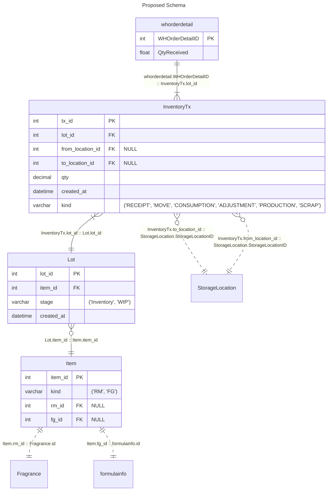
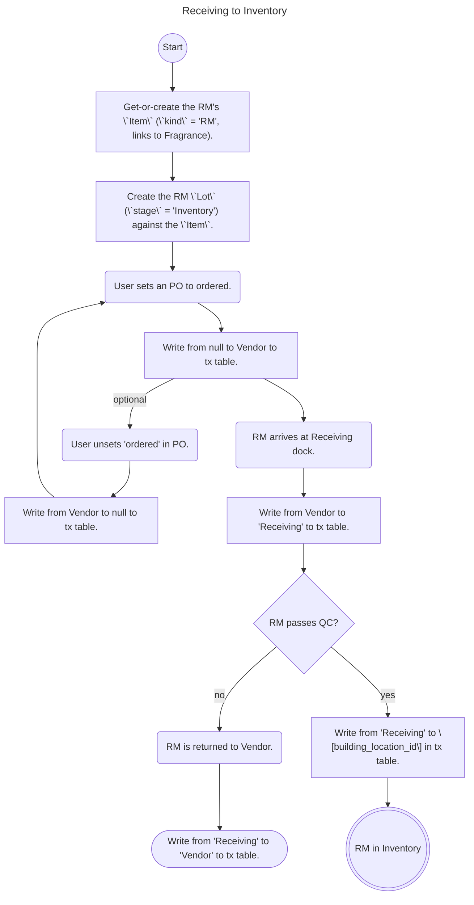
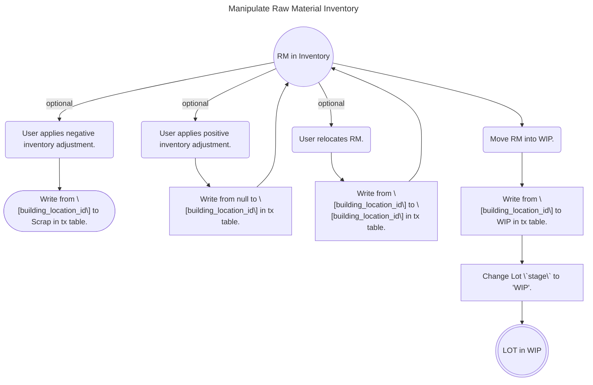
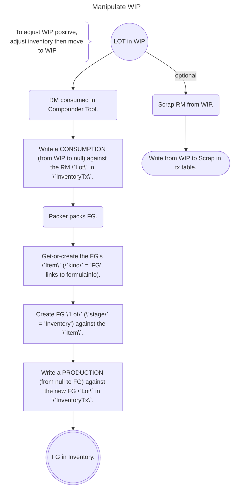
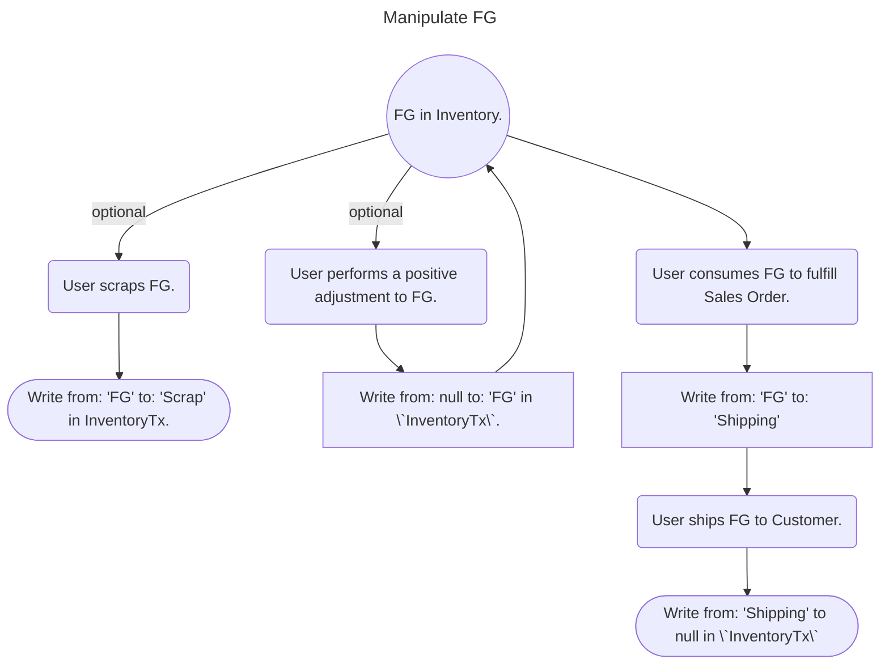
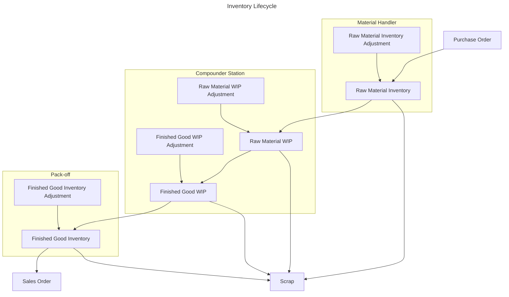
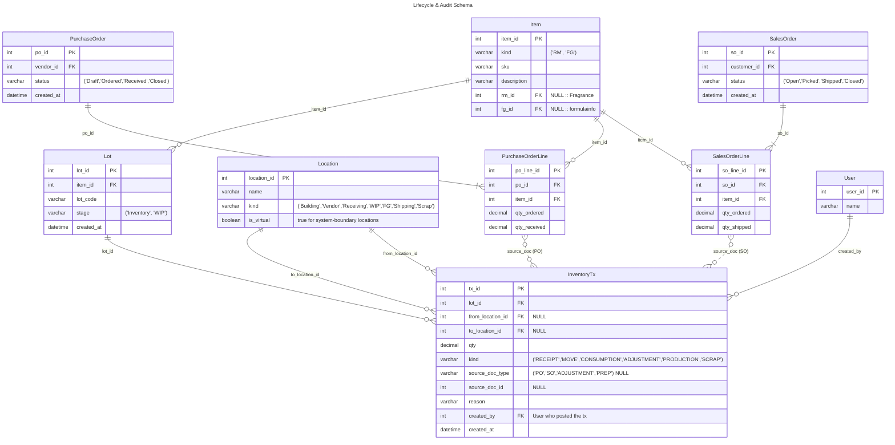

# Tx Table Proposal

## Diagrams

> [!WARNING]
> Current layout not showing Formula Stock Inventory?

The schema below is built to facilitate this life-cycle. Every stage transition
in the flowchart above corresponds to one append-only row in `InventoryTx`, which
serves as the immutable transaction history (ledger) for auditing material flow.

> [!NOTE]
> `InventoryTx` is **append-only**. Corrections are made by posting a reversing
> transaction, never by editing or deleting a row — this preserves a complete
> audit trail. The `source_doc_type` / `source_doc_id` pair is a polymorphic link
> back to whatever drove the movement (a PO line, SO line, adjustment, or prep),
> and `created_by` records who posted it.

> [!TIP]
> `Location` generalizes the legacy `StorageLocation` (building locations,
> `is_virtual` = false) together with the system-boundary "Special Locations"
> below (`is_virtual` = true). Current on-hand by lot/location is a `SUM(qty)`
> view over `InventoryTx`, never a stored balance.

Each life-cycle transition maps to exactly one `InventoryTx` row:

| Life-cycle transition | `kind` | `from` → `to` | `source_doc` |
| --- | --- | --- | --- |
| Purchase Order → RM Inventory | `RECEIPT` | `Vendor` → `Receiving` → `[building]` | PO line |
| RM Inventory Adjustment (+/−) | `ADJUSTMENT` | `null` → `[building]` / `[building]` → `Scrap` | adjustment |
| RM Inventory → RM WIP | `MOVE` | `[building]` → `WIP` | prep |
| RM WIP → FG WIP (consumed) | `CONSUMPTION` | `WIP` → `null` | prep |
| FG WIP → FG Inventory (pack-off) | `PRODUCTION` | `null` → `FG` | prep |
| FG Inventory Adjustment (+/−) | `ADJUSTMENT` | `null` → `FG` / `FG` → `Scrap` | adjustment |
| FG Inventory → Sales Order | `MOVE` | `FG` → `Shipping` → `null` | SO line |
| Any stage → Scrap | `SCRAP` | `[stage]` → `Scrap` | adjustment |

### Special Locations

- Vendor
- Receiving
- WIP
- FG
- Shipping
- Scrap

## Goals

- [x] Single Source of Truth

> Accomplished with InventoryTx table for both RMs & FGs w/ views.

- [x] Transactions for **all** RM & FG movements

> `InventoryTx` and `Lot` tables accommodate this.

- [x] Net-0 tables

> Using views (old::new): 16:12

- [x] Minimal Tool Breakage

> Views with matching interface to replaced tables will reduce breakage. Will still require populating `InventoryTx` table to match current state.

## Notes

> [!CAUTION]
> Changing the process to use `InventoryTx` table will break **all** inventory-related writes & updates. This will require an overhaul of the system, projected to affect more than 80% of the code.

> [!NOTE]
> Tracing which WIP LOTs _could_ have affected a pour is separate from the internal LOTs consumed when a pour is performed. Internal LOTs should **always** consume FIFO regardless of traced internal LOT(s).

> [!TIP]
> Pours should generate `Consumptions` against the RM (possibly using the Command/Event pattern), and those consumptions should be applied against the WIP inventory in FIFO order _after_ the pour is completed.

> [!IMPORTANT]
> RSM wants to use `InventoryTx` table for **both** Raw Materials and Finished Goods.

> [!TIP]
> CoPilot recommends a `Lot` table in order to track both Raw Materials and Finished Goods within the `InventoryTx` table. Each `Lot` carries a surrogate `lot_id` and references an `Item`, whose `kind` enum (`'RM'`, `'FG'`) distinguishes Raw Materials from Finished Goods; the `Lot.stage` enum (`'Inventory'`, `'WIP'`) tracks where the lot sits in its life-cycle. _When accessing a `Lot`, its `Item.kind` should **always** be checked._

> [!IMPORTANT]
> RSM wants to replace `formula_stock_lot_adjustment`, `WHPrepStockDetail`, `whprep_StorageLocation_Lot`, `whorderdetail`, `whprepdetail_qtydetail`, and `multi_StorageLocation` with views against `InventoryTx` table as interfaces to prevent tool breakage.

> [!NOTE]
> Following FIFO physically on the floor is impractical, does not have much benefit, and physical processes keep the state close enough to correct.

> [!TIP]
> Adding the `Item` table goes against keeping the number of new tables to a minimum, but we are still well below the net-0 table requirement by using the views. CoPilot insists that the `Item` table is necessary for referential integrity, keeping query complexity minimal (reducing number of joins), performance and indexing, and future flexibility.

## Questions

Why is the current system tying pours directly to LOT numbers for consumption?
  :

Why does the system require a specific LOT assignment at time of `Start Prep`?
  :

When a Raw Material is consumed for a Finished Good, but the Finished Good has not been packaged, where is the Raw Material at that point? It's in the Finished Good, but the Finished Good doesn't truly exist yet. When the Finished Good is made, where should it come from? WIP?
  : The RM is consumed out of `WIP` at pour time (a `CONSUMPTION` tx, `WIP` → `null`) and is **not** tracked as a discrete lot between pour and pack-off (consistent with not following FIFO physically on the floor). The Finished Good is _produced_, not moved: at pack-off a new FG `Lot` is created and a `PRODUCTION` tx (`null` → `FG`) brings it into inventory. Consumption and production are independent postings against different lots, so the FG is **not** sourced "from WIP" — doing so would double-debit `WIP`.

When more Finished Good is found during a cycle count, and the inventory is positively adjusted, what should be the `from`?
  : The `from` is `null` — a positive adjustment is an `ADJUSTMENT` tx (`null` → `FG`) against the FG `Lot`, mirroring the `Manipulate FG` flowchart's `tx_adjust_fg_positive`. The material has no prior tracked location (it was unaccounted-for stock surfaced by the count), so there is no source to debit. The same shape applies to a positive RM adjustment (`null` → `[building_location_id]`); a negative adjustment instead writes to `Scrap`.

Should additional "Special" locations be added for system boundaries ("Vendor", "Customer", etc.)? Current flowcharts show both yes and no.
  :
