# FW3 Walkthrough

This chapter is a hands-on tour of the FW3 ERP. It walks through the **main
revenue flow** — a sales order from creation all the way to shipment — and then
covers the supporting **side flows**: creating customers, vendors, and items, and
running a purchase order through receiving and QC.

Everything below is written against the running app and the seeded **`demo`**
tenant. Where a step quietly changes the books underneath, a short note points at
[FW3 Schemas](./schemas.md) or the [Tx Table Proposal](./tx_table_proposal.md) for
the full story — you don't need to read those first.

> [!NOTE]
> Button and field names are quoted **exactly** as they appear on screen. If the
> app has moved on since this was written and a label doesn't match, trust the
> app — and please update this page.

## Before you start

1. Open the web app at <http://localhost:5173>.
2. Sign in to the **`demo`** tenant (dev login). You land on the **Inventory**
   list — the app's home.
3. The top navigation bar is your map. Left to right it carries: **Inventory**,
   **Raw Materials**, **Finished Goods**, **Locations**, **Cycle Counts**,
   **Quality**, **Formulas**, **Work Orders**, **Scheduler**, **Run Queue**,
   **Vendors**, **Purchase Orders**, **Customers**, **Sales Orders**, **Shipping**,
   and **Containers**.

> [!TIP]
> The `demo` tenant already has customers (e.g. **Lux Retail**), vendors, items,
> and formulas seeded, so you can follow along without building master data first.
> Order numbers (`SO-…`, `WO-…`, `PO-…`) are generated for you on save.

## The big picture

The main flow threads several screens together. Each arrow below is one user
action; the label under it is the page and button you use.

```mermaid
flowchart LR
  SO["Sales order<br/>(OPEN)"]
  PAY["Payment<br/>recorded"]
  REQ["Work order<br/>(REQUESTED)"]
  QUE["Queued"]
  REL["Released<br/>(PLANNED)"]
  STG["Staged"]
  CMP["Completed<br/>(FG in WIP)"]
  QC["QC approved<br/>(FG in INV)"]
  PK["Packed"]
  SHP["Shipped<br/>(SHIPPED)"]

  SO -->|Record payment| PAY
  PAY -->|Request production| REQ
  REQ -->|Scheduler: Queue| QUE
  QUE -->|Release to floor| REL
  REL -->|Stage components| STG
  STG -->|Complete| CMP
  CMP -->|Approve lot| QC
  QC -->|Package order| PK
  PK -->|Post shipment| SHP
```

> [!NOTE]
> The pour step — operators dosing each raw material into the batch — happens on
> the **compounder dosing tool**, a separate device, not in this web app. In the
> web flow, **Stage** reserves the materials and **Complete** consumes them and
> books the finished goods. See [the pour note](#a-note-on-pours) at the end of
> the main walkthrough.

A line that already has finished goods in stock can skip the production and QC
steps entirely — go straight from the order to **Packing** and **Shipping**. The
production detour below is what happens when a finished good must be *made* first.

## Main walkthrough: a sales order from order to shipment

### 1. Create the sales order

1. Go to **Sales Orders** and click **New SO**. The form is headed *New sales
   order*.
2. Pick a **Customer** from the dropdown (e.g. *Lux Retail*). Optionally fill in
   **Customer PO**, **Requested ship date** (defaults to three days out), and
   **Notes**.
3. Under **Lines**, click **+ Add line** and set:
   - **Type** — *Item* (sell an inventory item) or *Container* (sell packaging
     itself).
   - **Item / container** — the finished good you're selling. The unit price is
     suggested from cost + the customer's margin; the customer's historic average
     price shows beneath it with a **use** link.
   - **Qty** and **Unit price**.
   - **Packing** (item lines only) — optionally choose a container to pack the line
     into; the **Count** defaults from the container's fill capacity.
4. The row shows live **Cost** and **Margin**. A line priced below cost turns red.
5. Click **Create SO**. You land on the new order's detail page.

> [!NOTE]
> A below-cost line is blocked unless someone with the price-override permission
> ticks **Override and sell below cost** — the override is written to the order's
> audit trail.

### 2. Take payment

On the sales-order detail page, find the **Payments** section.

1. Enter an **Amount** (it's pre-filled with the balance due), choose a **Method**
   (CASH, CHECK, ACH, CREDIT CARD, WIRE), and optionally a **Reference**.
2. For a credit-card payment, a fee preview appears (e.g. *+ $12.50 CC fee →
   charge $512.50*); the server computes the authoritative fee.
3. Click **Record payment**.

When the order is fully paid, the **Paid** metric at the top shows a ✓ and a date.

> [!NOTE]
> Payment matters because production can only be **requested** once the order is
> paid — *or* the customer is on net terms (they receive goods before paying). If
> neither is true, the **Request production** button is disabled with a tooltip
> explaining why.

### 3. Request production

Still on the order detail page:

1. Click **Request production** (top right).
2. A banner confirms *Production requested — work orders created for the
   scheduler*, and a **Production work orders** strip lists the new `WO-…`
   number(s) with their status.

> [!NOTE]
> Each order line that needs making spawns a `ProductionWorkOrder` in the
> **REQUESTED** state. See the [Production](./schemas.md#production) and
> [Sales](./schemas.md#sales) sections of the schema for how orders, lines, and
> work orders relate.

### 4. Schedule the run

Go to **Scheduler**. This is a two-column board: **Requested** on the left,
**Queued** on the right.

1. Find your work order's card in **Requested**. It shows the target, batch size,
   customer, requested ship date, the pours needed vs. daily capacity, and any
   shortfalls.
2. Queue it one of three ways:
   - Click **Queue →** to drop it at the scheduler's suggested position.
   - Type a position and click **Queue at** for a manual slot.
   - Drag the card into the **Queued** column.
3. To batch-schedule, tick several **Requested** cards and click **Queue selected
   by rules** (it sequences them by ship date, customer rating, and so on).
4. In the **Queued** column, reorder with the **↑ / ↓** buttons or by dragging,
   then click **Release to floor** on a card (or **Release all**).

> [!NOTE]
> A **BLOCKED** tag and red shortfall list mean a material or container is short.
> This is advisory — you can still queue it. Use **Alert purchasing** on a
> shortfall to raise a purchasing alert. **Release to floor** moves the order from
> **QUEUED** to **PLANNED** *without* moving any material — staging is the floor's
> job, next.

### 5. Build the batch

Go to **Run Queue**. Released orders appear under **Released — ready to stage**.
Click the `WO-…` number to open its detail page, then:

1. With status **PLANNED**, click **Stage components (INV → WIP)**. A banner
   confirms *Components staged into WIP*. The components table now shows quantities
   in the **Staged** column.
2. With status **STAGED**, click **Complete (consume → FG_WIP)**. A banner confirms
   *Work order completed — finished goods are in FG_WIP. Pack off from the
   Inventory page.*

> [!NOTE]
> **Stage** moves raw materials from usable inventory (`INV`) into work-in-progress
> (`WIP`). **Complete** consumes them and books the finished good into `WIP`,
> opening a QC lot. The mechanics — and why `WIP` isn't location-tracked — are in
> the [Tx Table Proposal](./tx_table_proposal.md).

> [!TIP]
> **A note on pours.** Between staging and completing, operators physically dose
> each raw material into the batch using the **compounder dosing tool**. That tool
> talks to its own API and reports each pour (which assigns pours to floor, lab, or
> robot under the hood). It isn't part of this web app, so the web walkthrough goes
> straight from **Stage** to **Complete**.

### 6. QC the finished goods

Completing a work order opens a quality-control lot for the finished good.

1. Go to **Quality**. Filter to **PENDING** and open your lot (its **Source** is
   the work-order number).
2. In **Acceptance tests**, enter a **Measured** value for each test. Numeric tests
   (specific gravity, refractive index, Gardner color, melting point) auto-evaluate
   against the spec range; judgment tests (odor, appearance) take an observation
   plus a **Pass / Fail** choice.
3. Click **Record results**, then **Approve lot** (or **Reject lot**, which prompts
   for a reason).

> [!NOTE]
> Approving a *production* lot moves the finished goods from `WIP` to usable
> inventory (`INV`) — now they can be packed and shipped. The **Lot movements**
> table at the bottom of the lot page is the lot's ledger genealogy. QC mechanics
> live under [Lots & quality control](./schemas.md#lots-quality-control-scrap--vendor-returns).

### 7. Pack the order

Back on the **sales-order detail** page, if any line specified a packing
container, a packing row appears.

1. Read the note: *Packing consumes the selected containers from inventory.*
2. Click **Package order** and confirm. The **Packed** metric shows a date, and a
   banner confirms *Order packed — containers deducted from inventory.*

> [!NOTE]
> Packing is a one-time action that deducts the containers from container stock. An
> order with no container lines skips this step.

### 8. Ship

You can ship from the sales-order detail page or from the **Shipping** queue
(**Shipping** lists all open and partially-shipped orders, oldest first, with the
usable stock **Available** per line).

1. In the **Ship now** column, enter the quantity to ship for each line.
2. Fill in **Carrier** (e.g. *UPS*), **Tracking #**, and optional **Notes**.
3. Click **Post shipment**. A banner confirms *Shipment posted — inventory reduced
   at cost (COGS)*, and the shipment is listed with its number, carrier, and
   tracking (all editable after the fact).

The order's **Status** becomes **PARTIAL** if some quantity remains, or **SHIPPED**
once every line is fully shipped.

> [!NOTE]
> Each shipment snapshots the finished good's unit cost as COGS at ship time and
> posts a `SHIPMENT` line that removes stock from `INV`. See
> [Shipments](./schemas.md#shipments).

That's the whole arc: **OPEN → paid → REQUESTED → QUEUED → PLANNED → STAGED →
COMPLETED → QC approved → packed → SHIPPED.**

---

## Side walkthrough A: Create a customer

1. Go to **Customers** and click **New customer**.
2. Fill in **Name** (required) and any of **Code**, **Email**, **Phone**,
   **Website**, **Tax ID**.
3. Set **Payment terms** (e.g. *NET 30*, *COD*) and **Rating (buy volume)** A–D —
   the rating drives the price-suggestion margin on sales orders.
4. Optionally add **Addresses** (**+ Add address**, choose a kind and mark one
   **Primary**) and **Contacts** (**+ Add contact**).
5. Click **Add customer**.

## Side walkthrough B: Create a vendor

1. Go to **Vendors** and click **New vendor**.
2. Fill in **Name** (required) and contact fields, plus **Payment terms**.
3. Under **Supplies**, tick **Raw materials / bases** and/or **Containers**. This
   controls which line subjects the purchase-order form offers for this vendor.
4. Optionally add addresses and contacts.
5. Click **Add vendor**.

## Side walkthrough C: Create an item

1. Go to **Raw Materials** and click **New raw material** to open the item form
   (titled *New item*). The form's **Item type** selector lets you switch the tier,
   so this is also where you create bases and finished goods.
2. Set **SKU**, **Name**, optional **Description**.
3. Choose **Item type** — *Raw material*, *Base*, or *Finished good* — and
   **Physical form** (*Liquid* or *Solid (crystal)*), which drives the QC test
   suite.
4. Set **Handling unit** (LB or KG; inventory is always stored in pounds) and
   **Sales price**.
5. Under **QuickBooks / accounting**, set the item type, standard/purchase cost,
   **Reorder point**, and accounts as needed. Raw materials also get a
   **Regulatory** panel (production use, floor-only handling, CAS number, flash
   point, Prop 65, IFRA limits).
6. Click **Save**.

> [!NOTE]
> The item master holds **no quantity**. On-hand and average cost are derived from
> the stock ledger. After saving, reopen the item and use **Adjust inventory** to
> post an opening balance or correction. To *make* a finished good, it also needs a
> **Formula** (under **Formulas**, raw materials by percentage, summing to 100) —
> see [Item master & formulas](./schemas.md#item-master--formulas).

## Side walkthrough D: Purchase order — generate, receive, QC

### 1. Create the PO

1. Go to **Purchase Orders** and click **New PO**.
2. Choose the **Vendor**, then add lines for the items or containers being bought
   (the choices honor the vendor's **Supplies** flags), each with an ordered
   quantity and unit cost.
3. Save the PO. It opens in status **OPEN**.

### 2. Receive

On the PO detail page, with the order **OPEN** or **PARTIAL**:

1. In the **Receive now** column, enter the quantity arriving for each line, and a
   **Supplier lot #** if you have one (leave it as *auto* otherwise). KG lines show
   the pounds they'll store.
2. Choose a dock from the **Receive into** dropdown.
3. Click **Post receipt**. A banner confirms *Receipt posted — inventory and cost
   updated*, and the receipt appears in the **Receipts** table with its lot number,
   location, and **QC** status.

> [!NOTE]
> *Received goods go to quarantine pending QC.* Each material receipt opens a
> `PENDING` quarantine lot; container receipts go straight to container stock. The
> PO rolls up to **PARTIAL** as lines are partially received, and **RECEIVED** once
> every line is fully received. See [Purchasing](./schemas.md#purchasing).

### 3. QC the receipt

1. Go to **Quality**, filter to **PENDING**, and open the lot (its **Source** is
   the vendor name).
2. Enter measured values and judgments exactly as in
   [step 6 of the main flow](#6-qc-the-finished-goods), then **Record results**.
3. **Approve lot** to move the material from quarantine into usable inventory
   (`INV`), or **Reject lot** with a reason.
4. If a received lot is **REJECTED** (or already **RETURNED**), a **Return to
   vendor** panel appears: enter a quantity and optional **RMA #**, then **Return
   to vendor**. This removes it from quarantine as a recoverable debit rather than
   a loss.

---

## Where to go next

- **[FW3 Schemas](./schemas.md)** — the full data model behind every screen here.
- **[Tx Table Proposal](./tx_table_proposal.md)** — how inventory moves are
  recorded across the two ledgers (quantity/cost vs. physical location).
- **[FW Backlog](./fw_backlog.md)** — what's planned but not yet built, so you know
  the edges of the current app.
